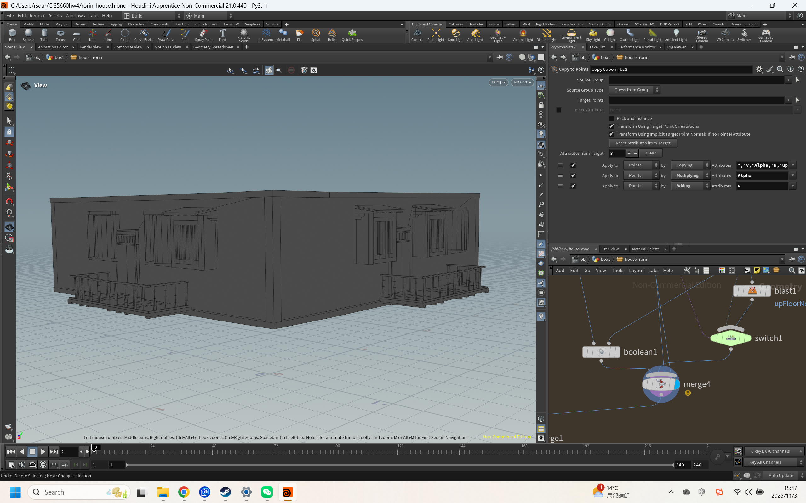
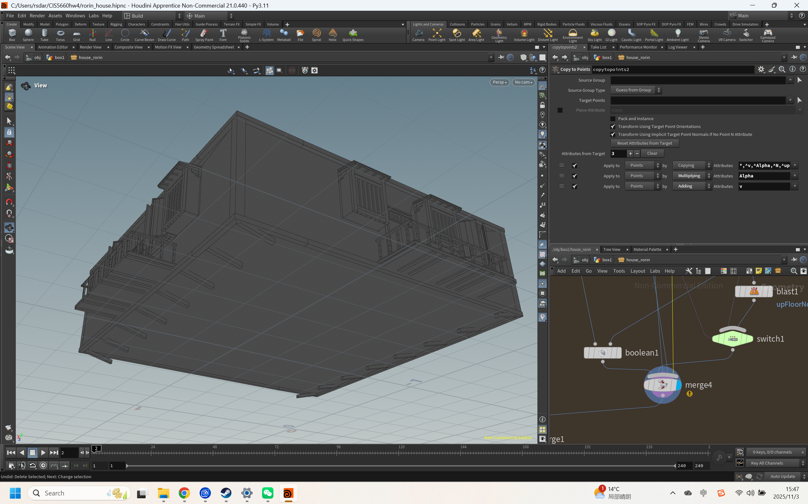
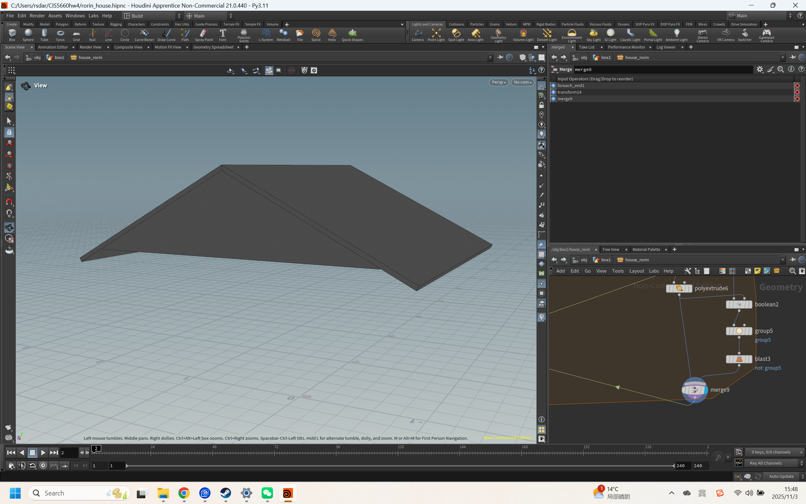
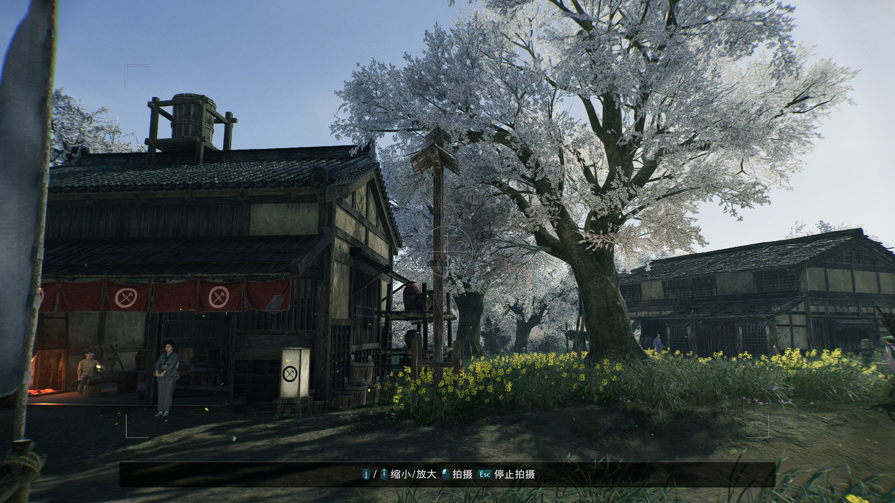
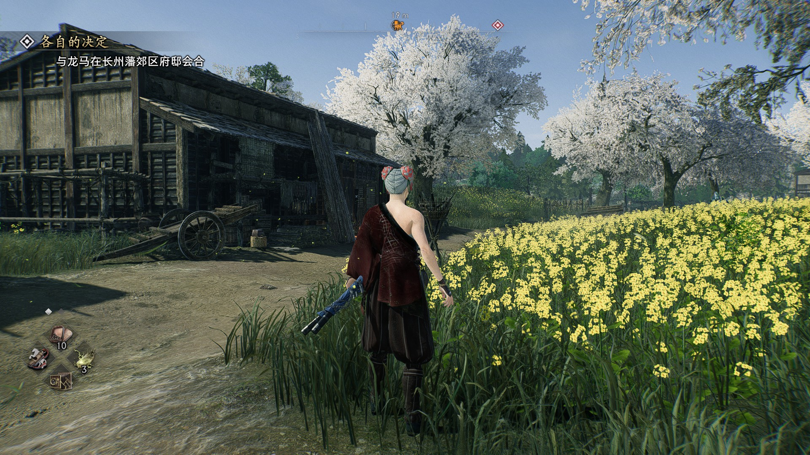

# CIS 5660 HW04 Procedural Buildings

---

## Project Overview

This project creates a procedural building generation tool in Houdini inspired by traditional Japanese architecture from the game *Rise of the Ronin*. The tool generates multi-story wooden frame buildings.

#### Implementation

### Part 1: Box Stacking HDA

Following the tutorial, I created a basic HDA tool that stacks boxes to form the fundamental framework of multi-story buildings.

### Part 2: Adding Details

Initially attempted to procedurally generate doors, windows, and balconies in Houdini, but found the results didn't match the selected Japanese traditional architecture style. Therefore, I modeled the doors, windows, and balconies in Rhino and imported them into Houdini to integrate with the procedural system.

### Part 3: Pillars and Borders

Following the tutorial, I added pillars and borders to each floor.

### Part 4: Supports

Added support structures for overhanging floors.

### Extra Credit: Roof

Added a roof system to the building.

## 

## Demo Video

[hw4 house - YouTube](https://youtu.be/b_YiNX9kMFE)

## Target

**Reference: Screenshot from Rise of the Ronin** 

*Traditional Japanese buildings from Rise of the Ronin*.

**Overall Structure:**  Multi-story wooden frame with clear horizontal layers - Dark wooden frames with light-colored wall panels 

**Roof:**  Steep sloped roof with tiles or thatch - Deep overhanging eaves 

**Doors and Windows:**  Sliding lattice doors and windows 

First floor features vertical wooden slat doors - Fabric curtains with family crests at entrances 

**Balconies:**  Second floor has narrow balconies with wooden railings 

**Support Structure:**  Dark wooden pillars at corners form the frame - Horizontal 

**beams separate floors**  Building elevated on support pillars - External wooden stairs 

---
